# Explainable Lung Nodule Malignancy Classification from CT Images

MSc Computer Science Dissertation Project

## Overview

This project presents an explainable deep learning framework for lung CT nodule classification using public medical imaging datasets. The system combines a supervised MobileNetV2 input-domain validator, a fine-tuned DenseNet121 classifier, Grad-CAM visual explanations, and Gemini-generated natural-language explanations within a Flask web application.

Three transfer-learning architectures were evaluated:

- EfficientNetB0
- DenseNet121
- ResNet50

The final architecture was selected using validation PR-AUC to avoid
using the test set for model selection.

Fine-tuned DenseNet121 was selected as the final model.

## Project Highlights

- 🎓 MSc Computer Science Dissertation Project (University of East London)
- 🩺 Fine-tuned DenseNet121 for benign vs malignant lung CT nodule classification
- 🛡️ Dedicated MobileNetV2 input-domain validator to reject unsupported images
- 🔥 Grad-CAM visual explainability
- 🤖 Gemini AI-generated prediction explanation
- 🌐 Flask web application
- ✅ Automated testing using pytest
- 📊 Comprehensive evaluation on independent test datasets


## Input Domain Validation

A dedicated MobileNetV2 model validates whether an uploaded image belongs
to the supported lung CT nodule domain before malignancy prediction.

| Metric | Result |
|---|---:|
| Test ROC-AUC | 1.000 |
| Test PR-AUC | 1.000 |
| Supported CT Acceptance | 97.66% |
| Benign Acceptance | 97.74% |
| Malignant Acceptance | 97.14% |
| Chest X-ray Rejection | 100% |
| MRI Rejection | 100% |
| Ultrasound Rejection | 100% |
| Natural Image Rejection | 100% |


## Final Model Performance

| Metric | Value |
|---|---:|
| Validation ROC-AUC | 0.861586 |
| Validation PR-AUC | 0.587677 |
| Test ROC-AUC | 0.855333 |
| Test PR-AUC | 0.588136 |
| Validation F1 Threshold | 0.669041 |
| High-Recall Threshold | 0.445648 |

## Architecture Comparison

| Architecture | Validation PR-AUC | Test ROC-AUC | Test PR-AUC |
|---|---:|---:|---:|
| DenseNet121 | 0.587677 | 0.855333 | 0.588136 |
| EfficientNetB0 | 0.570277 | 0.830252 | 0.633736 |
| ResNet50 | 0.497598 | 0.822883 | 0.562283 |

DenseNet121 was selected using validation PR-AUC.
Test metrics were used only for final evaluation.

## Explainability

Grad-CAM is applied to:

`conv5_block16_2_conv`

to generate class-targeted visual explanations.

Gemini is used only to explain the DenseNet121 prediction and
Grad-CAM metadata in plain language. Gemini does not perform the
classification.

## The Flask application includes:

- Image upload and validation
- Supervised MobileNetV2 input-domain validation
- Fine-tuned DenseNet121 inference
- Validation-selected decision thresholds
- Grad-CAM visual explanations
- Gemini AI-generated explanations
- Automated pytest test suite
- Robust error handling for unsupported or invalid uploads

## Repository Structure

```text
├── notebooks/
│   ├── Notebook_01_Preprocessing.ipynb
│   ├── ...
│   └── Notebook_16B_Domain_Validator.ipynb
│
├── app/
│   ├── models/
│   ├── services/
│   ├── templates/
│   ├── static/
│   ├── tests/
│   ├── app.py
│   └── config.py
│
├── docs/
│   ├── screenshots/
│   └── figures/
│
├── results/
│   └── figures/
│
├── README.md
├── requirements.txt
└── LICENSE
```


## Running the Web Application Locally

### Prerequisites

- Python 3.x
- Git
- Internet access for Gemini API explanations
- A Gemini Developer API key

### 1. Clone the repository

```bash
git clone <YOUR_REPOSITORY_URL>
cd <YOUR_REPOSITORY_NAME>
```


### 2. Open the Flask application

`cd app`

### 3. Open the Flask application
- Windows
`python -m venv .venv
.venv\Scripts\activate`

- macOS/Linux
`python3 -m venv .venv
source .venv/bin/activate`

### 4. Install dependencies
```bash
pip install -r requirements.txt
```

### 5. Download the Trained Models

Download the following files from the GitHub Releases page:

- `best_model.keras` (DenseNet121 classifier)
- `domain_validator.keras` (MobileNetV2 input-domain validator)
- `domain_threshold.json`

Place them inside:

```
app/models/
├── best_model.keras
├── domain_validator.keras
└── domain_threshold.json
```

### 6. Configure environment variables
`GEMINI_API_KEY=your_api_key_here
GEMINI_MODEL=gemini-3.6-flash
FLASK_SECRET_KEY=replace_with_a_private_random_value`

### 7. Verify the model
`python -c "from config import MODEL_PATH; print('Model available:', MODEL_PATH.exists())"`

### 8. Run automated test 
`pytest -v`

### 9. Start flask 
`python app.py`

Then open:
`http://127.0.0.1:5000/`


### 10. Health check

Open `http://127.0.0.1:5000/health`

The endpoint should return a successful JSON response.


```markdown
## Application Architecture


Uploaded Image
      │
      ▼
Image Validation
      │
      ▼
MobileNetV2 Domain Validator
      │
      ├───────────────┐
      │               │
Unsupported       Supported
      │               │
      ▼               ▼
 Reject        DenseNet121
                   │
                   ▼
             Benign/Malignant
                   │
                   ▼
                Grad-CAM
                   │
                   ▼
           Gemini Explanation
                   │
                   ▼
              Final Report

```
## Application Workflow

1. User uploads an image.
2. File type and integrity are validated.
3. MobileNetV2 verifies whether the image belongs to the supported lung CT domain.
4. Unsupported images are rejected before any diagnosis.
5. Supported CT images are analysed using DenseNet121.
6. Grad-CAM generates a visual explanation.
7. Gemini AI produces a natural-language explanation.
8. The final result is displayed to the user.

## Web Application

### Upload Interface

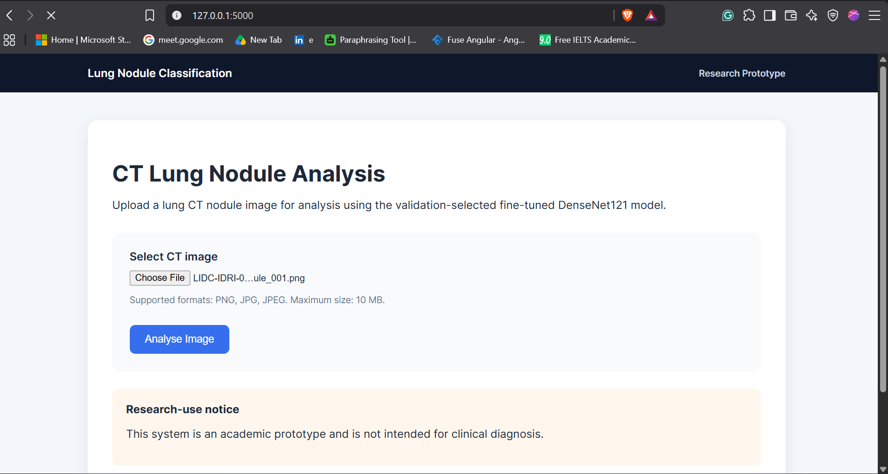

### DenseNet121 Prediction with Grad-CAM

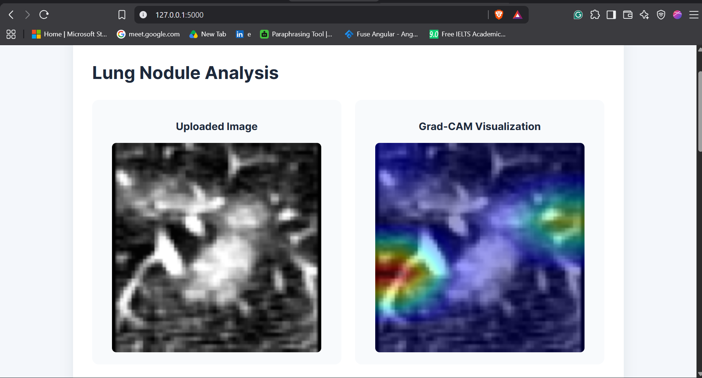
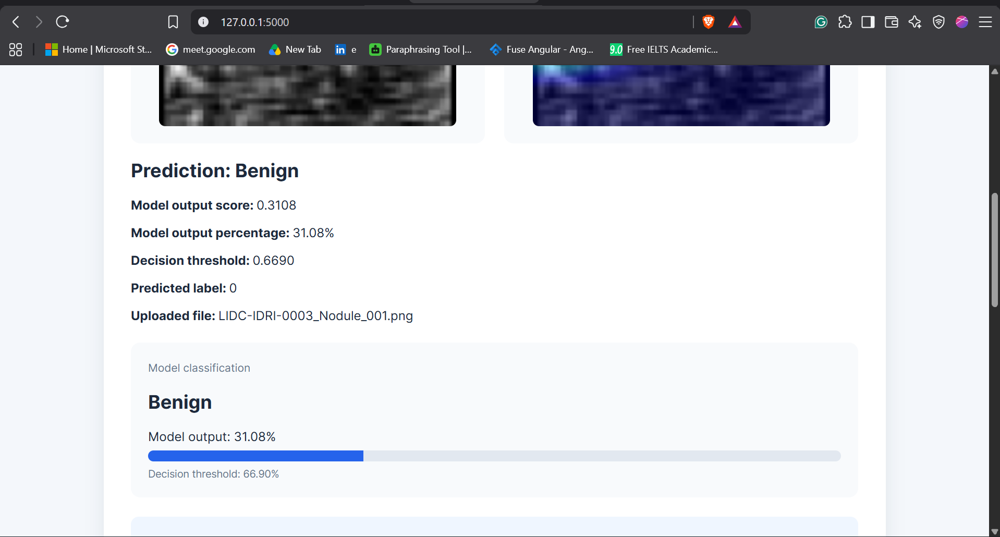

### Automated Test Suite

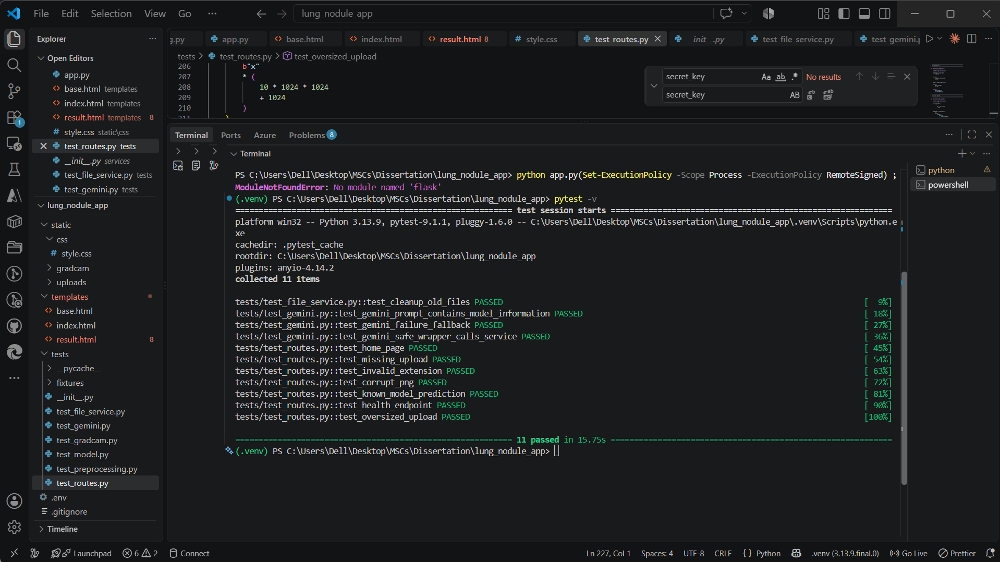

### AI Assistant Explanation

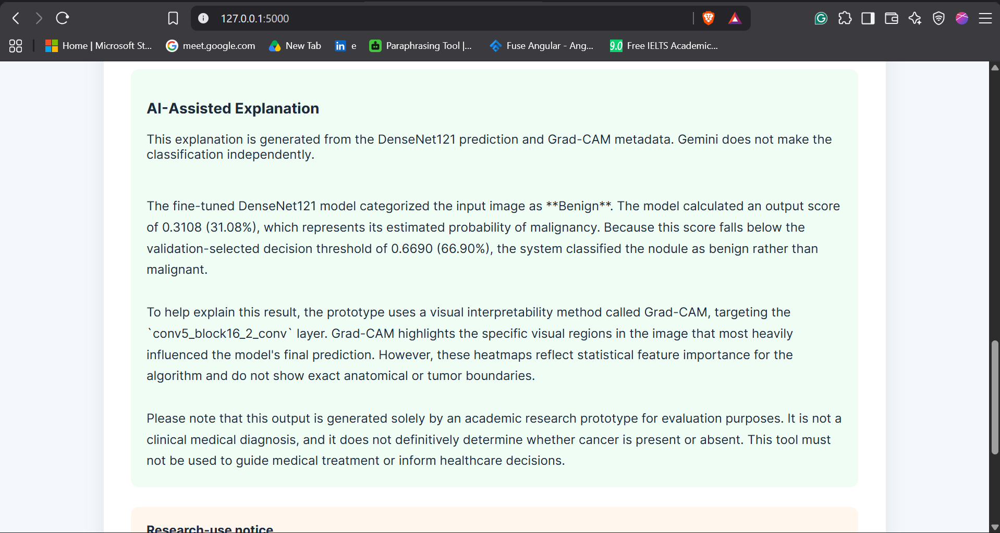


## Experimental Results

### CNN Architecture Comparison

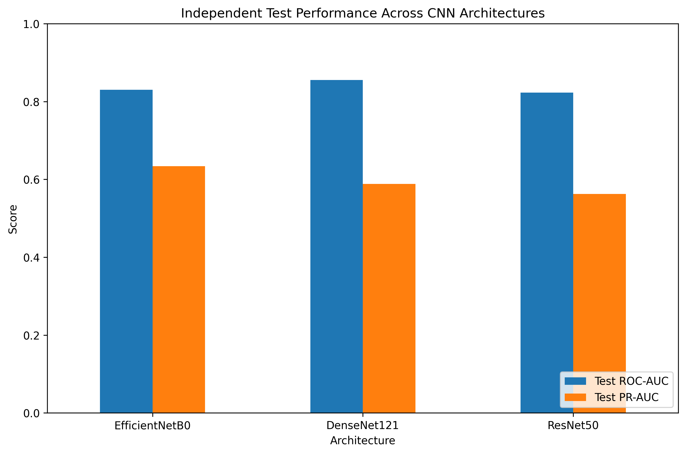

### Final DenseNet121 ROC Curve

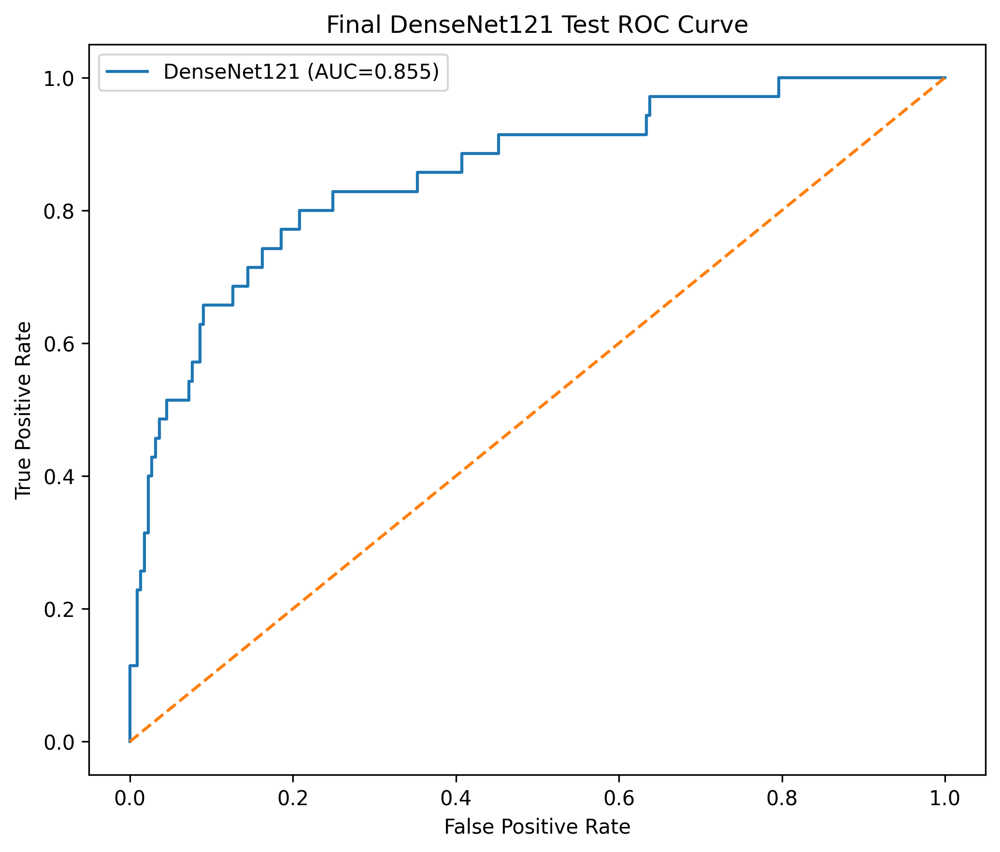

### Final DenseNet121 Precision-Recall Curve

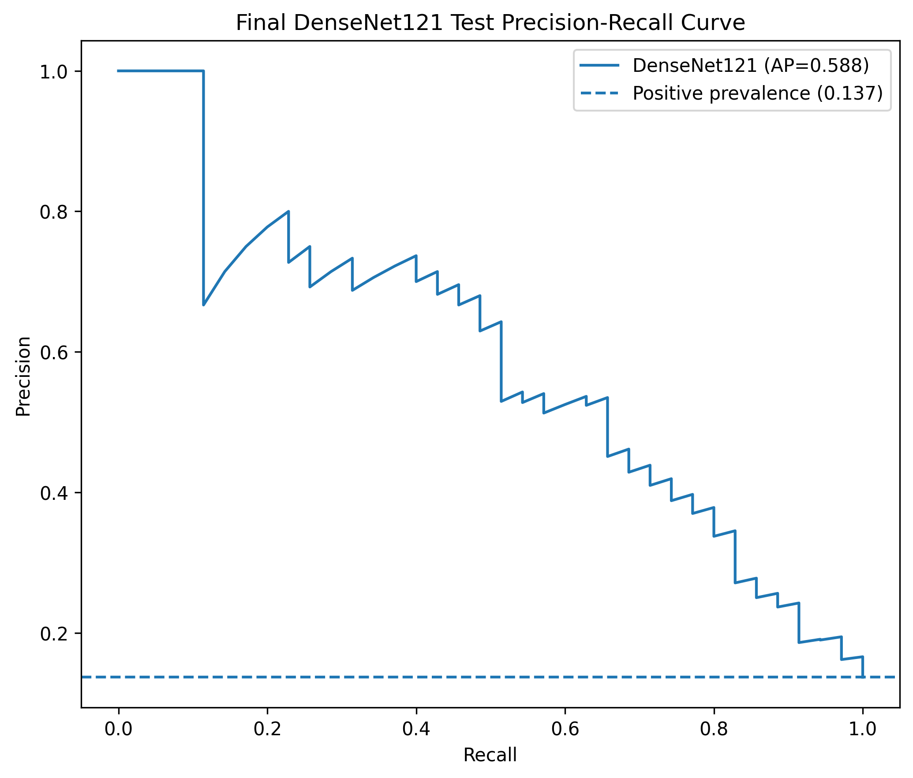

### Final Confusion Matrix

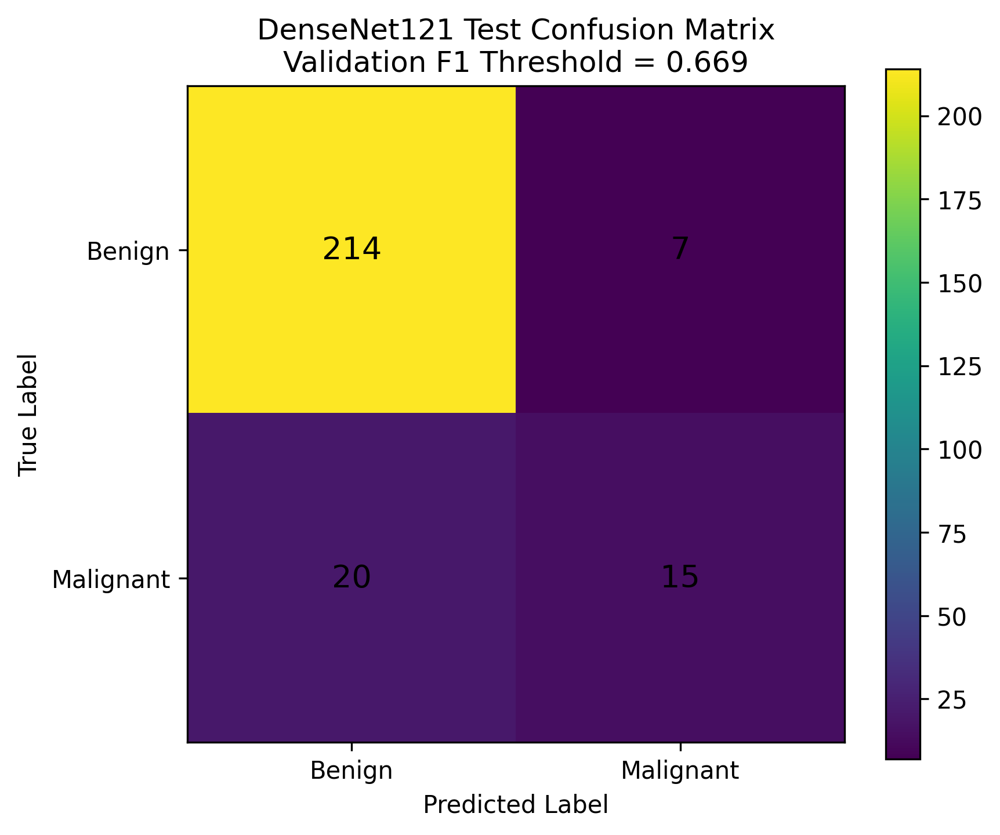

### Grad-CAM Explainability

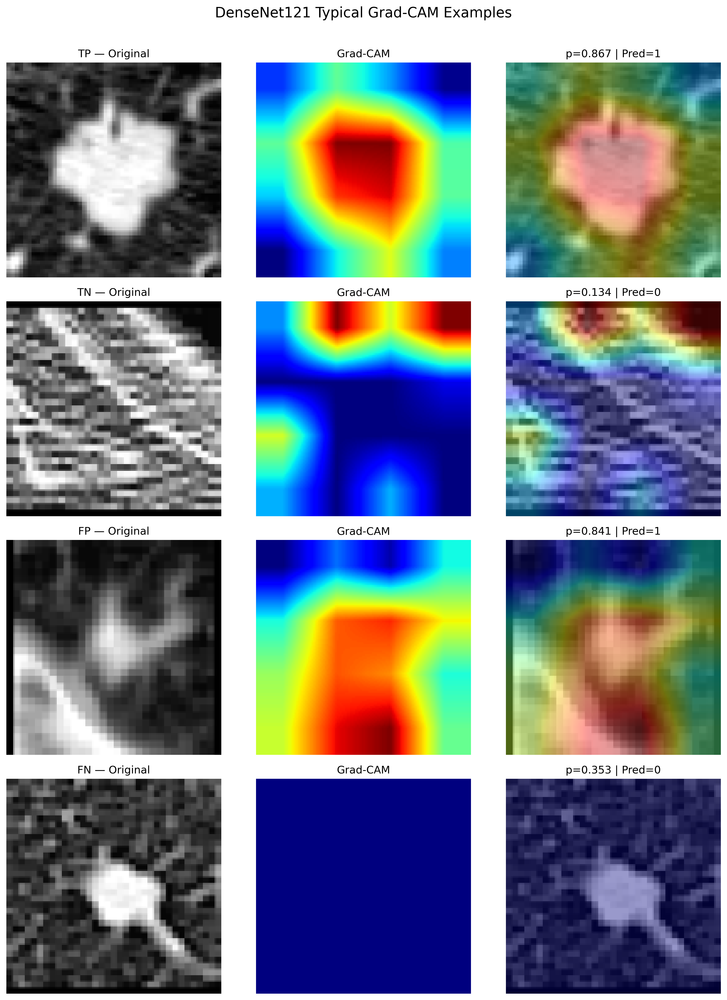

### Unsupported Image Detection

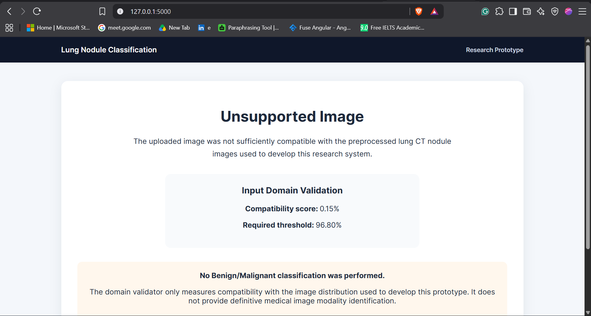


### Test Coverage

The application was validated using automated and manual tests covering:

- Supported CT image prediction
- Benign prediction
- Malignant prediction
- Chest X-ray rejection
- MRI rejection
- Ultrasound rejection
- Natural image rejection
- Invalid file upload
- Corrupted image handling
- Oversized upload rejection
- Flask route testing
- Gemini API integration

## Limitations

- This application is intended for research purposes only.
- It does not provide a clinical diagnosis.
- The model was trained on public datasets and should not be used in clinical practice.
- The domain validator measures compatibility with the training distribution rather than identifying imaging modalities with certainty.
- The system currently supports single-image inference only.

## Future Work

Potential extensions include:

- Native DICOM upload support
- 3D CNN or Vision Transformer models
- Multi-class pulmonary disease classification
- Segmentation-guided malignancy prediction
- PACS integration
- Clinical validation using larger multi-centre datasets

## Citation

If you use this repository, please cite:

Ranjeet Kumar Mahato

Explainable Lung Nodule Malignancy Classification from CT Images

MSc Computer Science Dissertation

University of East London

2026

## License

This project is released under the MIT License.